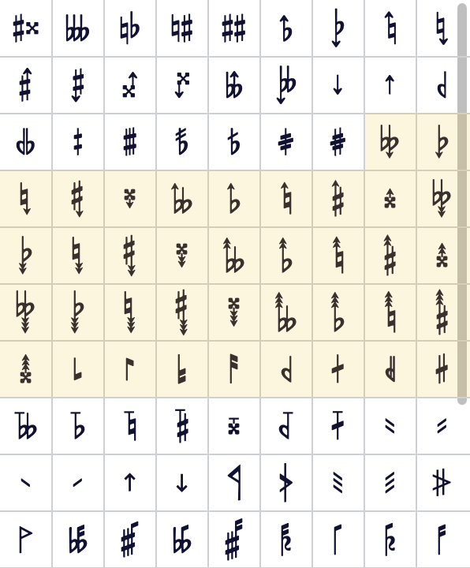
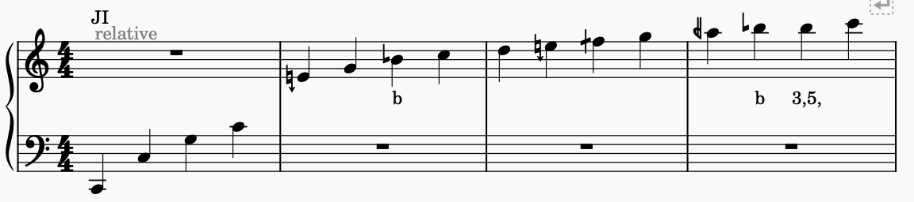
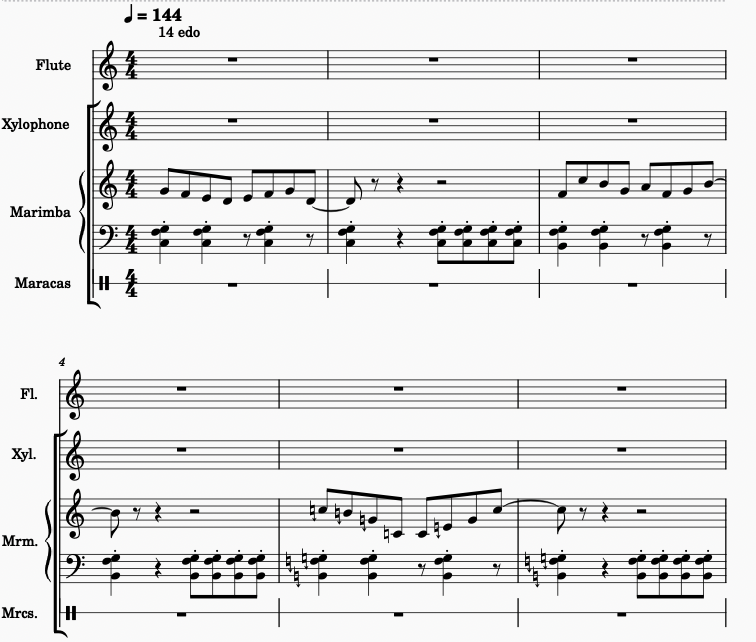
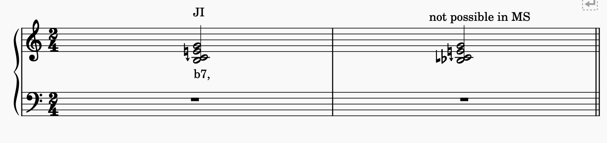
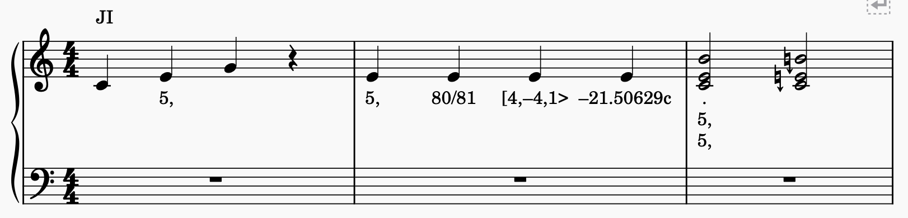
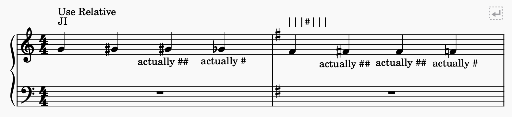
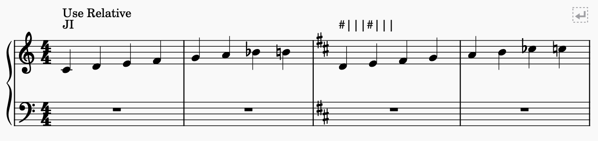
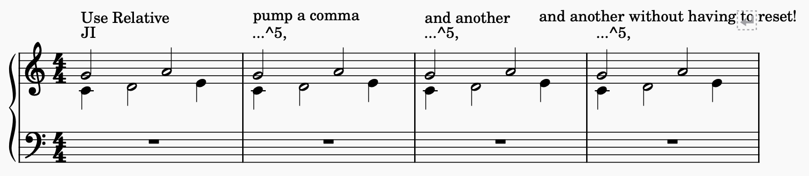

# XenKit: A Configurable Microtonal Tuner for MuseScore 3 and 4

> This plugin is based off of @euwbah's previous tuning plugins for MuseScore 3 and 4. The plugin is intended to be a temporary solution until the new XenTuner comes out.

> [!CAUTION]
> This plugin is still under development and does not include some features. See [Planned Features](#Planned-Features-and-workarounds).

## Features / Guide

### Getting Started

Download, drag and drop the folder into /MuseScore3(or4)/Plugins and refresh the plugins list. It is recommended to bind this plugin to a key like <kbd>opt</kbd><kbd>t</kbd>. You will need to run this plugin every time you make changes to retune.

### Tuning Systems

Write the name of the tuning system using system text (case-insensitive):

- `JI`, `Just Intonation`, `Pythagorean` will tune to JI (HEJI notation)
- `19edo`, `19EDO`, `19 edo`, `19-edo`, `19 ed2`, `19-ET`, `19 equal temperament` etc. will tune to 19edo (chain of fifths notation)

> [!IMPORTANT]
> When changing tuning, you must also re-annotate the key signature or it will parse the key signature using the old temperament.

Tune to JI using HEJI accidentals:

Or to EDOs using the 5-limit "arrow" accidentals above to tune up or down one edostep:

### Lyric Accidentals

Sometimes, more than one accidental is needed. MuseScore will only allow you to input one accidental per note (symbols excluded), so you can use a **lyric** as an accidental (<kbd>cmd</kbd><kbd>L</kbd>).

Lyric accidentals are versatile. The following example shows several examples of how lyric accidentals can be used to tune the E to 5-limit.

> [!WARNING]
> Writing a lyric accidental will **override** any existing accidentals and the key signature if you are in absolute mode. To get around this, prefix it with a `*` to make it relative.

### Rules for constructing intervals
These rules apply for lyric accidentals as well as key signatures.
- `5,`, `7,`, etc. are equivalent to the n-limit HEJI commas. Prefix with a `^` or `v` to specify upwards or downwards (eg. `^5,`).
- `80/81` corresponds to the ratio
- `[4,–4,1>` corresponds to a monzo. Since you cannot type spaces or minus signs in a lyric, use commas and dashes (<kbd>opt</kbd><kbd>-</kbd>) instead (however, they will still work in key signatures).
- `–21.5c` or `¢` corresponds to cent values. Use dashes for negatives.
- `1\12` for 1 step of 12edo.
- `S4` for the 4th squared superparticular, 16/15
- `#`, `b`, `x`, as well as `^` and `v` in edos work as expected. Multiple accidentals can be stacked (eg. `^^bbb`), or a quantifier may be used (eg. 2^3b);

You can chain multiple intervals together with spaces (or `*` in lyrics) (eg. `3/2 1\12`, `3/2*1\12`).

Append a `*` or `=` to the begging to make the interval relative or absolute (we'll get to that later).

### Key Signature Annotations

> [!IMPORTANT]
> You must annotate **all** your key signatures with system texts. You must also re-annotate key signatures when changing tuning systems. The plugin will ignore the built-in MuseScore key signatures.

To annotate a key signature, write its accidentals from C to B separated by `|`s. The accidentals follow the same format as lyric accidentals.

You can also append a global multiplier with three dots `...` after the key signature, which will be applied to all naturals.

Examples:
- C# D# F# G#: `#|#||#|#|`
- 5-comma to every note `...5,`
- 10¢ increase with F# `|||#|||...10c`
- individual naturals can be made relative or absolute: `=#|||=#|||*b`

### Relative Mode

> [!INFO]
> Not sure if this is a good idea, so please let me know what you think.

By default, the plugin starts in absolute mode. You can toggle to relative mode and back by writing `Relative`, `Absolute`, `Use Absolute`, or `Use Absolute Tuning` (case insensitive).

Absolute mode will behave like expected. Lyric accidentals in absolute mode **override** key signatures and accidentals.

In relative mode, all changes made to a note and key signature is **relative** to its existing tuning information.

This means that accidentals in the same bar will multiply with each other.
Naturals will reset the note's accidentals like absolute mode but will still stack with any existing key signature.
This may be useful for working with JI or scales with more than 7 notes (e.g. you can emulate a tonic shift with `...5,` and relative mode, and scales written in different keys will still appear the same).

Additionally, **key signatures will also be parsed relative to the previous key signature.** This means that they will stack with each other (`|||#|||` and later `#||||||` will be equivalent to `#|||#|||` in absolute mode).
This is useful if you are repeatedly pumping a comma in JI, and to avoid overly long chains of accidentals.

## Planned Features (and workarounds)

- Tonic shifting (you can use global key signature (...) with relative mode on)
- Transposing instruments (turn on concert pitch before tuning)
- Local key signatures / temperaments
- The ability to fully customize accidentals like in @euwbah's XenTuner plugin
- Support for symbols if MS API allows
- Some accidentals aren't supported, like half-sharps and sagittal

## Contact

Have any questions, suggestions, or looking to collab? Feel free to contact me on my Discord (azure_7147).

